# OSPprobe

OSPprobe is a tool to capture OSP telegrams "mid-chain"; it is powered via OSP.

The OSPprobe itself has an OLED screen which shows up to 30 captured telegrams. 
For more serious analysis OSPprobe can send all captured telegrams, in 
text format, via serial-over-USB (CDC), to a PC. PC software is
available to show a live feed in Wireshark using this serial data.

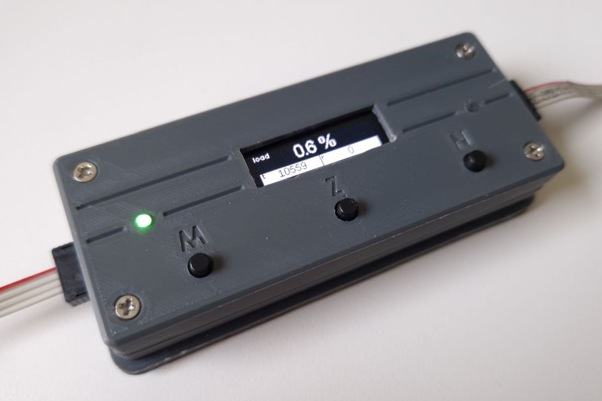

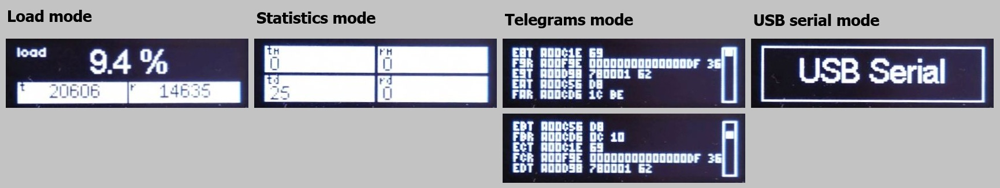

> The OSPprobe _hardware_ is not part of the Arduino OSP evaluation kit.
> The _firmware_ is provided in this directory. Note that the firmware is 
> dedicated capturing software, disconnected from the aolibs. 

We believe that OSPprobe can be an attractive addition when analyzing OSP systems.
Making an OSPprobe on a breadboard is straightforward; you need an ESP32S3
and a level shifter (and some resistors). Optionally add an OLED, LEDs 
and buttons. The last section of this document shows how to make OSPprobe 
from those components.


## Introduction

OSPprobe consists of hardware and software. Physically it is a box 
with two ERNI connectors that can be inserted anywhere in the OSP bus (where 
LVDS is used). OSPprobe is powered via the OSP bus. It shows OSP bus load 
and/or other statistics or even captured telegrams on its OLED screen. 
OSPprobe captures both the downstream commands ("transmitted" by the root MCU) 
and the upstream responses ("received" by the root MCU). OSPprobe is the gray 
box in the center of the image below.

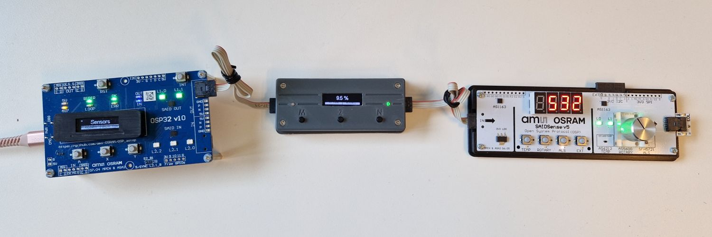

OSPprobe also has a USB connection. This allows OSPprobe to send all captured 
telegrams to a connected PC. This PC could run a network analyzer like 
Wireshark, interpreting the telegrams captured by OSPprobe.
This document explains OSPprobe, its internals, how to use it and how to setup 
Wireshark to digest its output.

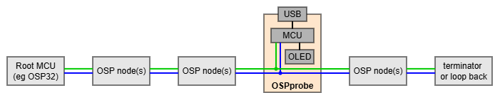


## Technical background

This section contains technical implementation notes of OSPprobe. Feel free to skip.

OSPprobe uses an ESP32S3 as capturing device. 
The ESP has two cores, which communicate via 
two queues that pass around telegrams. Core 0 together with the ESP's RMT 
hardware block captures the telegrams. Core 1 decodes them (Manchester) and 
either displays them on the attached OLED, or it uses the ESP's CDC hardware 
block to send the decoded telegrams over USB to the PC. Native CDC achieves 
higher throughput than an external USB-to-Serial chip.

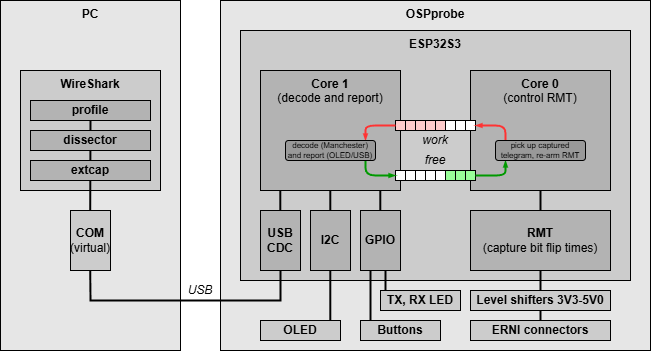

Optionally a PC is connected. On the PC a network analyzer like 
Wireshark could run. A network analyzer needs three components: a 
capture utility (an "extcap" in Wireshark lingo), a telegram dissector
(with knowledge of the telegram fields and the meaning of the bit patterns) and 
a profile (which fields to show for each telegram type, how to filter and/or 
color them).

Timing is critical. The diagram below shows a trace of 
high speed repetitions of _setpmwchn_.
The first image, which is a zoom-in of the second image, 
shows how a bus load is computed:
- A _setpwmchn_ telegram is 12 bytes or 96 bits, which take, at 2.4MHz, 40 µs.
  This is the width of the first green box, the captured _setpwmchn_).
- The OSP protocol mandates a minimal idle time (no signal on the bus) of 8 µs
  between telegrams. 
- We therefore say that the 40 + 8 or 48 µs is the "in use" time.
- The actual gap to the next telegram is 23 µs. 
  This means that to send the _setpwmchn_, the "elapsed time" is 40 + 23 or 63 µs.
- The computed load is 48/63 = 76 %.
- The remaining 24% is in the unused gap (23 - 8 or 15 µs or 15/63=24%) between telegrams. 

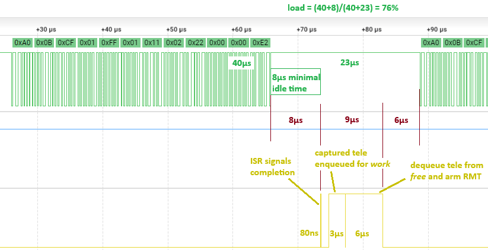

Observe that Core 0 receives the RMT completion interrupt (telegram captured) 
after 8 µs. It does need to do some work: context switch, enqueue the captured 
data for decoding, dequeue a free telegram and re-arm the RMT block.
All this work takes 9 µs, executed after the 8 µs latency for the interrupt.

> If inter telegram gap is shorter than 17 µs, 
> OSPprobe can not arm the RMT block in time and the next telegram is missed.

Capturing is done on Core0.
In the second image we also see that Core1 of the ESP32 is loaded high.
This is mainly due to Manchester decoding, but time is also spend on reporting.

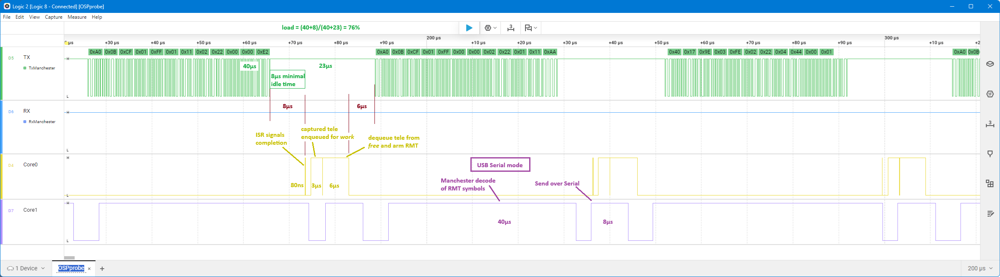

The diagram below shows a repeat of _readstat_ commands (green) and its responses (blue).
Note that both are captured (yellow) and processed (purple).

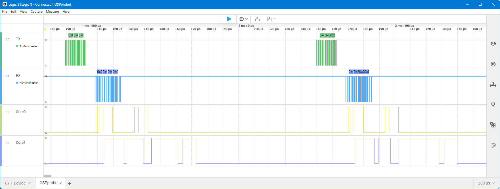

The telegrams have a much larger idle gap, so both cores are also idling more.


## Restrictions

This section enumerates some restrictions of the current implementation of OSPprobe.

- If the gap between telegrams is less than ~20 µs OSPprobe is not fast enough
  to capture the full telegram. This will be reported as a decoding error, 
  and no bytes will be reported. 
  See also [`aospi_idletime_us_set()`](https://github.com/ams-OSRAM/OSP_aospi/blob/main/src/aospi.cpp).

-	Each telegram must start with a 1 bit (OSP preamble is 0b1010);
  if not, OSPprobe reports there is a telegram decoding error (no bytes reported).
  
-	Each bit in the telegram is made up of one low and one high plateau and 
  those plateaus must be 200 µs ± 50 µs. 
  Violations lead to telegram decoding error (no bytes reported).
  
-	The captured telegram must have a number of bits that is an 8-fold (full byte). 
  Otherwise, again, OSPprobe reports a decoding error (no bytes reported).
  
-	The telegram must not be too long (longer than 12 bytes) or too short 
  (less than 4 bytes). 
  In practice telegrams miss-formed in this way do not make it mid bus,
  earlier nodes will have modified/stopped them.
  
- OSPprobe can only be inserted on an LVDS line; 
  it turns the LVDS line into a USE line by adding pull-ups.
  In USE mode, one line is dedicated for TX and one for RX.
  To make both nodes match, the lines are crossed.  
  
  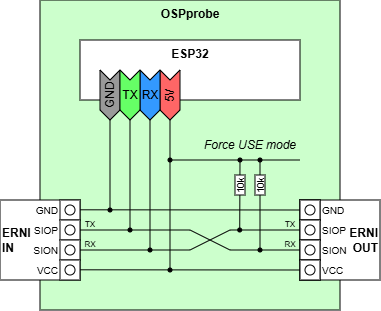

  This setup means that OSPprobe can be used anywhere where two nodes 
  connect with LVDS, the most common case, especially in the EVK.
  This does however exclude the MCU modes, which means that the telegrams 
  towards the very first node can not be intercepted. Similarly the 
  EOLN mode is excluded, so intercepting all responses for a loop 
  configuration is also not possible, the last node must be skipped.

  The fourth communication mode USE is a bit of a border case. 
  Since OPSprobe actually needs the USE mode itself, electrically this 
  can be made to work. We can not just plug-in a CAN adapter in the ERNI 
  connector of OSPprobe: the TX/RX needs to be crossed again. 
  An alternative is to not use the ERNI connectors of OSPprobe, but instead 
  power OSPprobe via its USB plug and solder wires from the GND/T5/R5 on 
  [pin header J7](../../extras/schematics/OSPprobe_v3.pdf) to the TX/RX lines 
  of the CAN adapter.
  
  However, if the SIOP and SION lines of an OSP node connect to TXD and RXD 
  lines of a CAN transceiver, the CAN transceiver will repeat any message 
  received via RXD on its TXD. In other words, any telegram send by the OSP 
  node on SIOP is received by the CAN transceiver on its RXD and duplicated 
  on its TXD, which means it is also on SION. 
  
  Below captured trace shows that. An _identify(0x002)_ (`A0 08 07 6A`)
  is transmitted by the MCU (on the TX line), with a slight delay it is 
  duplicated (by the CAN transceiver) on the RX line. We see every sent 
  telegram twice. 
  
  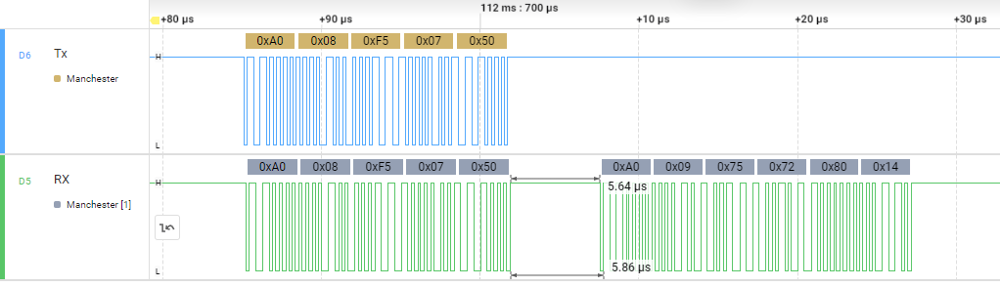
  
  Seeing every sent telegram back is sub-optimal. A bigger problem is when
  the response (`A0 0A 07 00 00 00 40 28`)  comes from the first node after 
  the CAN transceiver as in this above capture.
  It comes 5.6 µs after the  duplicated command, too fast for OSPprobe 
  to re-arm itself for the second reception.
  
  We suggest to add a node in the chain before switching to USE/CAN and insert
  OSPprobe before that node. A BranchStarter board (in reverse orientation) does 
  both with one small board.


## OSPprobe User Manual

This section describes OSPprobe, the functionality of the hardware and 
firmware, from a user perspective.

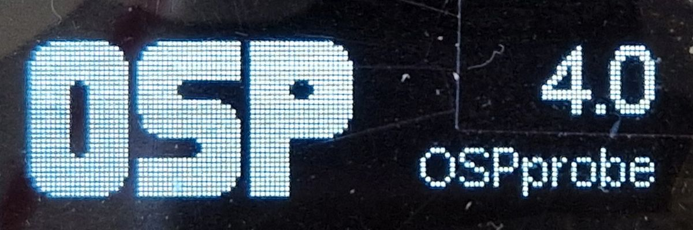


### Context

The OSPprobe can be wedged between two OSP node. The probe _monitors_ 
(taps, sniffs) the OSP bus, it does not insert an _active_ node. It does 
however, change the connection type from LVDS to USE. The probe monitors 
both the TX as well as the RX line. 

> Terminology alert: the OSPprobe tool uses the terms TX and RX (MCU perspective).
> TX is for sending commands downstream, 
> RX is for receiving responses upstream.

Since OSPprobe could also be flipped 180 degrees, these terms are not absolute.
TX is about telegrams coming in via the ERNI connector at the back (left) and
RX is about telegrams coming in via the ERNI connector at the from (right) of 
the OSPprobe PCB.

The probe is _powered_ by the OSP bus. Optionally, the probe can also be 
attached with a USB-C cable to a PC; this powers OSPprobe and the OSP bus.

Data captured by OSPprobe can be shown on its OLED. If the USB cable is 
connected data can also be passed to the PC. The USB data is passed as ASCII, 
any terminal program can be used to inspect the data. However, the data rate 
might be high (5Mb/s) therefore it might be better to feed the data to 
e.g. Wireshark.

The OSPprobe tool uses an ESP32S3 to capture telegrams. The ESP uses the RMT 
block and core 0 to run dedicated capture software. When a telegram 
is captured it gets a sequence number and a timestamp (µs). In case the 
capture queue is full the telegram is discarded (but not its sequence number). 
This could happen when core 1 (reporting telegrams) is too slow. In 
practice this does not happen. A captured telegram is (Manchester) decoded
by core 1, decoding does sometimes lead to errors (we believe around 300ppm
or 0.03%).

The highest load the `aolibs` can generate approaches 80%; this is due to 
relatively long idle-gaps between telegrams sent via `aolibs`. If the idle-gap 
is reduced and thus the load increases, OSPprobe is probably not fast enough
to capture telegrams. 


### Placement

The position of OSPprobe in the OSP chain requires some consideration.

A typical place is right after the OSP32 board. All command telegrams (and all 
responses) for the entire chain will be captured, except of course, the commands addressed 
to the very first node on the OSP32 board. For example, OSPprobe will not capture
_initbidir(001)_ but rather _initbidir(002)_.

If in the chain under investigation, the ERNI connector OSP32.OUT 
has a CAN adapter plugged in, OSPprobe can not be wedged between 
the OSP32 and the CAN adapter (see [Restrictions](#restrictions)).
We suggest to add another OSP node: OSP32-OSPprobe-ExtraNode-CANadapter...(CAN). One 
quick solution that might work is to use a BranchStarter in reverse for the latter 
two: OSP32-OSPprobe-reverseBranchStarter...(CAN).

The topology of the chain influences the measurement results.
Suppose we have a chain starting with a RootMCU (OSP32) driving a "Sensor board" and 
a "Light board". Assume the RootMCU firmware does an auto configure, detecting 
if the sensor board or the light board comes first, and how many lights there 
are in the chain. This auto configure is a common feature for EVK demos. 
Suppose the RootMCU constantly reads the sensor, and maps that to a light 
configuration. We also assume that response telegrams from the sensor board 
out-number the respose telegrams for the light board.

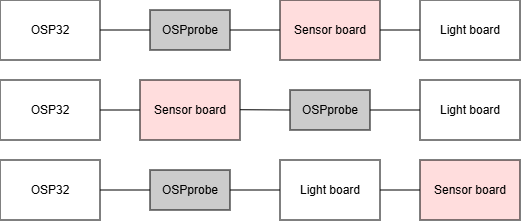.

A logical place to add OSPprobe is at that start of the chain, as shown in the 
figure above in the top diagram.

If we were to move the OSPprobe the the middle of the chain as is shown in the 
figure above in the center diagram, OSPprobe would no longer see the commands to 
the sensor board, nor would it see the responses from the sensor board 
(the sensor readings).

If we keep the OSPprobe at the start of the chain, but flip the position of the 
sensor board and the light board (bottom diagram), one might think 
not much will change in what OSPprobe measures. However, it is not unlikely that 
a large fraction of the OSP traffic is command telegrams to the sensor board and 
the corresponding response telegrams (with sensor readings) coming back. Since 
the sensor board is further down the chain in the bottom diagram, there is a 
larger gap between command and response, and thus a lower bus load in the lower 
diagram.


### Flashing firmware

The ESP32S3 is flashed with the project in the directory this document is found. 
We use [Arduino IDE](https://www.arduino.cc/) to flash it.
The project is loaded via sketch `ospprobe.ino`. 
Make sure to select `ESP32S3 Dev Module` as board. 

The firmware sends data over USB using CDC mode. 
Therefore CDC mode must be enabled in the Tools menu.

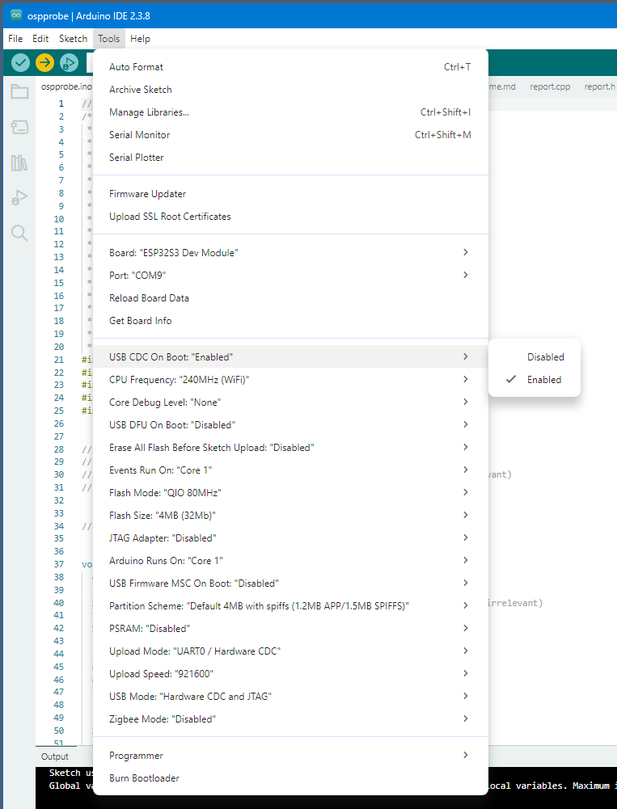

If this is enabled, this message is visible over USB when OSPprobe is 
connected to a PC and a terminal is open for its USB port. Since 
this is CDC (virtual serial) the baud rate is not relevant.

```
  ____   _____ _____                 _
 / __ \ / ____|  __ \               | |
| |  | | (___ | |__) | __  _ __ ___ | |__   ___
| |  | |\___ \|  ___/ '_ \| '__/ _ \| '_ \ / _ \
| |__| |____) | |   | |_) | | | (_) | |_) |  __/
 \____/|_____/|_|   | .__/|_|  \___/|_.__/ \___|
                    | |
                    |_|
OSPprobe - version 4.1

dbgpin: init
osprmt: init (pool 256 teles a 396 byte)
report: init
app   : init (on core 1)
```


### User interface

Already mentioned is that the OSPprobe board has _two ERNI connectors_ for the
OSP bus to monitor. The OSP bus also powers OSPprobe. Secondly there is an 
optional _USB connector_ to send captured telegrams to the PC.

On the OSPprobe board we also find _two LEDs_, the TX and the RX LED. They will
toggle each time a telegram passes on the TX respectively RX line, with a 
minimal toggle time of 50ms. This is just a visual cue telegrams are passing.

On the OSPprobe board we find _three buttons_, known as MODE, ZERO and NEXT.
These form the input side of the user interface. By pressing the MODE button 
OSPprobe cycles through its four modes: Load, Statistics, Telegrams and 
USB Serial.

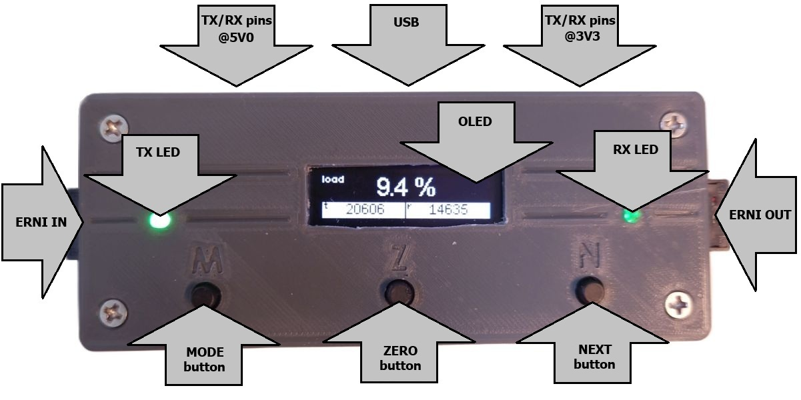


### Load mode

In the Load mode, the OLED shows the load of the OSP bus 
(top center in % with label "load"). Bus load is defined as the 
number of (micro)seconds the bus is busy per elapsed (micro)second. 
The bus is busy when telegram bits are present; but also an 
idle-gap of 8 µs per telegram is accounted as busy. The Load screen 
also shows the TX and RX sequence number; the TX sequence number is 
on the left (labeled `t`), the RX one on the right (labeled `r`). 
Pressing the ZERO button zeros both sequence numbers (just in the UI). 
Pressing the NEXT button has no effect in the Load mode.

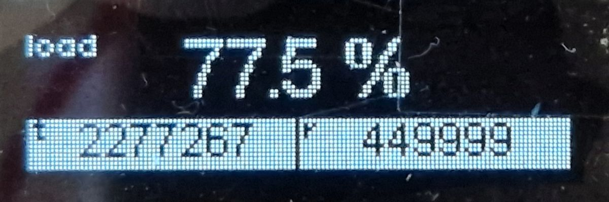


### Statistics mode

In the Statistics mode, the OLED shows the error statistics for 
the TX line (on the left) and the RX line (on the right). For both 
lines the OLED shows the number of _missed_ telegrams (jumps in the 
sequence number) and the number of Manchester _decoding errors_. 
Used labels are `tm`, `td`, `rm`, `rd`. 
Pressing the ZERO button zeros all four fields. 
Pressing the NEXT button has no effect in the Statistics mode.

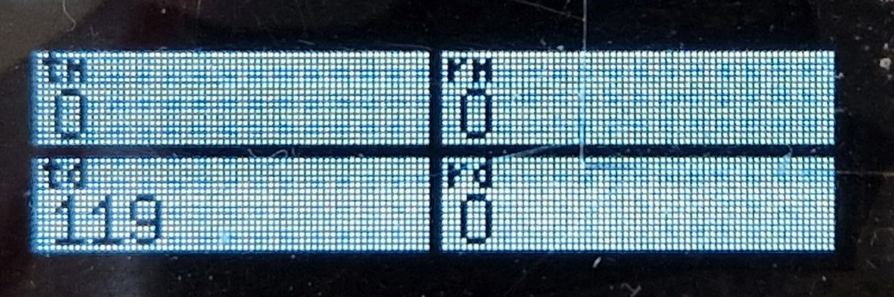


### Telegrams mode 

In the Telegrams mode, the OLED shows up to 30 captured telegrams. 
The ZERO buttons clears the list, but it will be filled with new telegrams 
once they are captured. 
The list is made up of 6 pages as indicated by the scroll bar on the right. 
To cycle through the pages use the NEXT button. 

- The format on the OLED is as follows

  ```
  00T 112233 445566778899AABB CC
  ```
  
- All numbers are in hex.
- The `00` are the last two nibbles of the sequence number of the telegram.
- The next character is the _tag_; it is either `T` or `R` 
  for a telegram captured on the TX or RX line. 
- After this "meta" data comes a space.
- The rest of the line is the actual captured telegram data.
   - First 6 nibbles (the 3 bytes `112233`) for the telegram header. 
   - The telegram/line ends with two nibbles (1 byte `CC`) for the CRC. 
   - If the telegram has a payload it placed between header and the CRC,
     separated by a space on each side.
   - The payload can be up to 8 bytes (16 nibbles, `445566778899AABB`).
- If the _tag_ is `t` or `r` (lowercase) this indicates a decoding 
  error happened. The rest of the line gives the error code 
  (see [`manc.h`](manc.h) for values and meaning) instead of the decoded telegram.

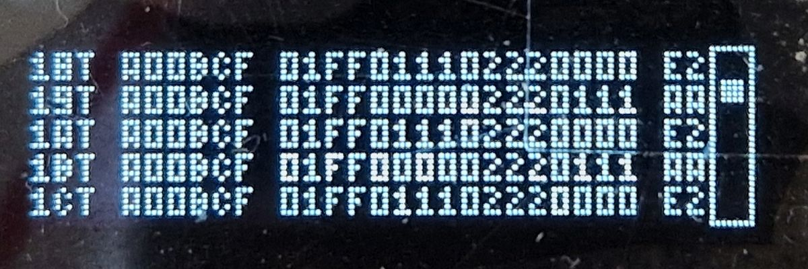


### USB serial mode

The final mode is USB serial. The OLED screen is once refreshed with a 
text showing the active mode, but from then on, all captured telegrams 
are sent (only) over Serial.
This is to ensure no time is lost on OLED updates, OLED updates take 6000 µs 
while a telegram is between 13 µs and 40 µs. The ZERO or NEXT button have no 
effect in USB Serial. There is one other way to switch _to_ USB Serial: send
any character (e.g. a space or CR/enter) over the serial-over-USB line towards 
OSPprobe. This is what the Wireshark (extcap) does.

- Any character sent from the PC to OSPprobe is ignored by OSPprobe, 
  however it does switch mode to USB Serial. 
  
- The format over USB is as follows

  ```
  25E3C7C7 BCA7TA00BCF01FF000002220111AA
  ```
  
- Also here, all numbers are in hex.
- The first 8 nibbles form the time stamp in µs.
- Then comes a space, which changes in a `+` when sequence numbers were skipped.
- The next 4 nibbles are the lower nibbles of the sequence number.
- Next is the tag, also here `T`, `R`, `t`, or `r` with the same meaning
  as in Telegrams mode.
- Then up two twelve bytes in hex nibbles (no spaces) and finally a linefeed.
- If the _tag_ is `t` or `r` (lowercase) this indicates a decoding 
  error happened. The rest of the line gives the error code in 8 nibbles
  (see `manc.h` for values and meaning). Eight nibbles is overkill, but this
  matches the length of the shortest allowed telegram, hopefully causing less
  anomalies in further processing.
- The line is terminated with a <LF> (character 10).
- See the next section for how to use Wireshark to process the USB data.

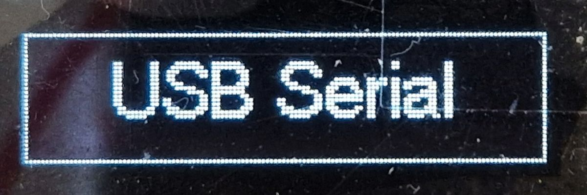


## PC software stack

In this section we describe Wireshark, a network analysis tool, which we use 
to analyze OSP traffic. Wireshark needs an _external capture utility_ or 
_excap_ to capture the telegrams from the COM port. We wrote the extcap in 
Python, so also Python must be installed (and two packages: `serial` and `crcmod`).
We have chosen to run extcap in a python _virtual environment_, to decouple python
version and packages from what is needed/wanted on the host PC.

To allow high level analysis, an OSP _dissector_ is used. This is another 
Wireshark plugin, written in Lua. It adds knowledge about the bit fields 
in the captured OSP telegrams. Finally, a Wireshark _profile_ is supplied.
This configures the Wireshark GUI to show the OSP relevant columns, using 
colors to highlight special cases.

The extcap software has one extra feature; it has a mode in which it spoofs random 
telegrams. This allows testing Wireshark and the three plugins without having 
OSPprobe (running). Do note that the spoofed random telegrams are not always OSP 
compliant.

We have developed the three "plugins": extcap, dissector and profile.
They can be found in [extras/ospprobe_wireshark](extras/ospprobe_wireshark).
That directory also has scripts to add the three plugins to the 
application tree of Wireshark. We opted for `WiresharkPortable64` since 
that does not nest itself in Windows.

The subsections explain how to install Wireshark and the plugins. 
Wireshark creates the below tree (blue). 
The location `c:\Programs` is free to chose.
The red boxes are the three plugins.
They will be added by the scripts in `ospprobe_wireshark` (green). 
The install needs Python (green). 
After installation the green parts are no longer needed.
We believe it is possible to zip the (blue) tree for distribution, 
but the zip file is 90MB so too big for email.

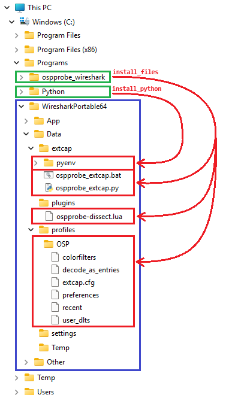


### Installation

- Go to Wireshark website to [download](https://www.wireshark.org/download.html) 
  it. We picked the Windows x64 **PortableApp** since it will least interfere
  with the system and does not require admin privileges.
  We picked English as language and installed in `C:\Programs\WiresharkPortable64`.
  You are free to pick another directory, but it might be wise to not have 
  spaces in the path, and also to have it outside the "admin" directories.

- Install [Python](https://www.python.org/downloads/) on your system if 
  you do not already have it. We have it at `C:\Programs\Python`.
  You need at least version 3.7 (the extcap uses f-strings).

- Copy directory [ospprobe_wireshark](extras/ospprobe_wireshark)
  as a sibling to WiresharkPortable64, i.e. at `C:\Programs\ospprobe_wireshark`.
  It **must be a sibling directory**, because the install scripts in 
  `ospprobe_wireshark` uses that to reach `WiresharkPortable64`.
  
- We need Python for the extcap; there is a script to install a copy of Python
  in Wireshark. Edit `install_python.bat` in `C:\Programs\ospprobe_wireshark`; 
  change the line `SET PYTHON=C:\Programs\Python` to match your Python location.

- Now run scripts to augment Wireshark with the extcap, dissector and profile.
  - Open a terminal window (e.g. `cmd.exe`) in `C:\Programs\ospprobe_wireshark`.
  - Install the extcap, dissector, and profile (3 red boxes) by running `install_files.bat`.
  - Install the Python environment for the extcap (`pyenv` in first red box) by running `install_python.bat`.
  - The two steps are independent; both add files to the 
    `WiresharkPortable64` application tree.

Here is a log of the script steps.

```cmd
C:\Programs\ospprobe_wireshark>install_files.bat
Creating directory ..\WiresharkPortable64\Data\plugins
Creating directory ..\WiresharkPortable64\Data\profiles
Installing extcap (external capture utility)
Installing dissector (osp telegrams)
Installing profile (osp view)
Done installing files

C:\Programs\ospprobe_wireshark>install_python.bat
Creating virtual python environment
Upgrading pip
Adding python packages
Done installing python for wireshark extcap

(pyenv) C:\Programs\ospprobe_wireshark>
```


### First run

- Run Wireshark.
  We made a shortcut on the desktop to 
  `C:\Programs\WiresharkPortable64\WiresharkPortable64.exe`.
  
- Wireshark gives a warning that 
  `Local interfaces are unavailable because no packet capture driver is installed`.
  We assume that has to do with being portable: Wireshark did not install 
  capture devices. Click `Don't show this message again`.

- Wireshark now presents a list of capture devices, OSPprobe should be in the list; 
  the [extcap](extras/ospprobe_wireshark/ospprobe_extcap.bat.src) adds this entry.
  It is boxed gray in the screenshot below.
  
  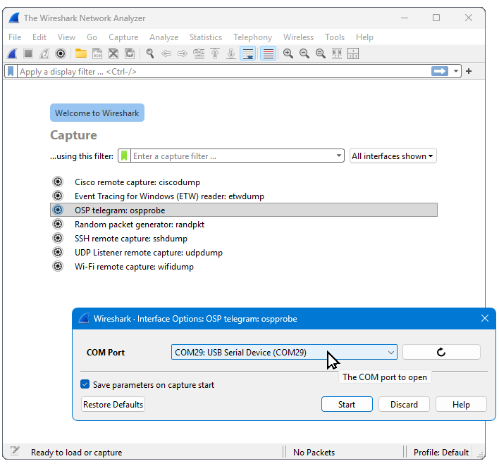

- Double click the `OSP telegram: ospprobe` capture device, to 
  start capturing OSP telegrams.

- The first time, we have to select the COM port for this capture device.
  The OSPprobe tool publishes itself as `USB Serial Device`.
  If OSPprobe is plugged in select e.g. `COM9: USB Serial Device (COM9)`.
  If no OSPprobe is plugged in, or for a quick test/demo, select
  `COMx: spoofed telegrams`.
  
  Note that Wireshark remembers the COM port from the previous run.
  If you want to switch COM port, click the gear symbol to the left
  of `OSP telegram: ospprobe`.

- Wireshark will now pop-up its main interface showing captured telegrams.
  Wireshark doesn't know OSP telegrams, it refers to "packets".

  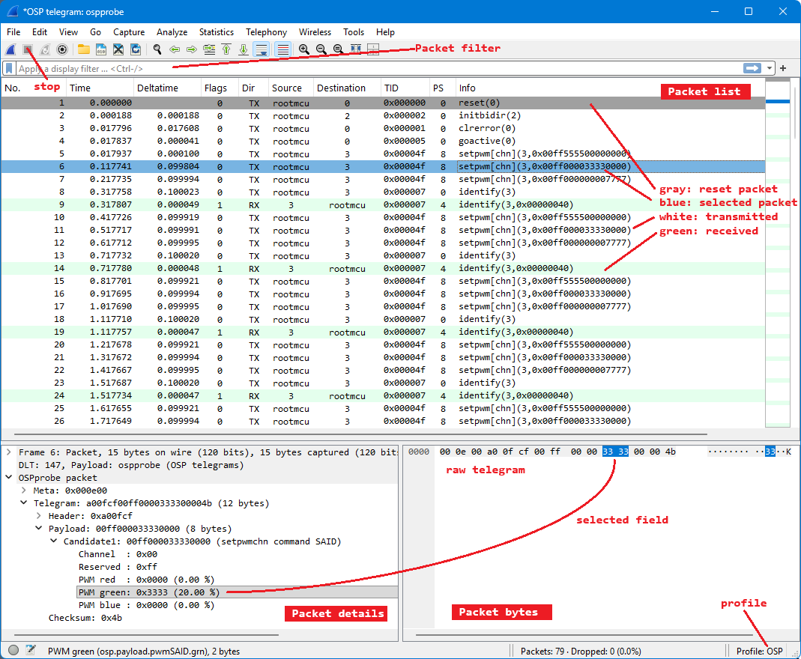
  
- All the packet details come from the 
  [dissector](extras/ospprobe_wireshark/ospprobe-dissect.lua.src).

- In lower right corner, click "Profile: Default" and select OSP.
  This is the [profile](extras/ospprobe_wireshark/profile-OSP) we developed.
  OSP profile configures columns (Edit -> Preferences -> side panel Appearance > Columns) 
  but also conditional row colors (View > Coloring Rules).
  Most telegrams (rows) are white, the Reset telegram is gray, responses 
  are green, errors are red. The selected row is blue.

- To stop capturing press red square in the toolbar (just below File and Edit).


### Packet list

- Every line/row in the "Packet list" (main pane) is a telegram 
  (either a transmitted command or a response).
- The first column ("No") shows the Wireshark index ("number") of the telegram.
- The "Time" column shows the time of capture (in seconds). 
  The "Deltatime" column shows how much time expired since the previous line/telegram.
- The "Flags" column has flag bits (direction, missing, decoding error, wrong CRC, wrong PSI).
- The "Dir" column indicates whether the telegram was a sent command (TX) or a 
  received response (RX) – perspective is the MCU.
- The columns "Source" and "Destination" give the OSP address of the sending and receiver node 
  (one of them is "rootmcu" the other is the 10-bit OSP address).
- "TID" shows the telegram ID. 
- The "PS" column shows the actual payload size in bytes; not the PSI (which encodes size 8 as 7).
- The telegram name is shown in the "Info" column. 
  Between brackets we see the address and the payload of the telegram – if there is any.
- There is artificial background coloring (View > Coloring rules)
  -	White for transmitted telegrams.
  -	Green for received responses.
  -	Red for telegrams with errors (none here).
  -	Gray for a reset telegram (marker for the beginning).
- On the right, left of the scrollbar, we see a condensed representation (minimap) of the pacaket list.
- At the bottom left of the screen (Packet details), we see the dissection of the selected telegram.
  On the right (Packet bytes) we see the raw telegram bytes, highlighted in blue is the 
  field selected in the Packet details.


### Analysis

- Select a telegram (row) in top pane "Packet List".

- In the bottom left pane "Packet details" fold open the telegram fields
  (the associated telegram bytes are high lighted in lower right pane "Packet Bytes").

- Please note that OSPprobe prepends 3 "meta" bytes (seqnum and flags) to each 
  telegram. The "seqnum" is the sequence number generated by the RMT controller
  (32 bits always increasing with wrap around). The "flags" include "TX" vs "RX"
  and errors like missing telegrams (jumps in seqnum) or Manchester decoding errors.

- Just under the button bar there is a filter box, 
  type e.g. "osp.header.tid == 0x40". 
  See the table below for the OSP related variables.
  There are also Wireshark native variables (`_ws`).
  
  | Variable               | GUI name         | Created by      |
  |:-----------------------|:-----------------|:----------------|
  | osp.meta               | Meta             | OSPprobe        |
  | > osp.seqnum           | Seqnum           | OSPprobe        |
  | > osp.flags            | Flags            | OSPprobe/extcap |
  | > > osp.flags.rxdir    | R (direction rx) | OSPprobe        |
  | > > osp.flags.miss_err | M (missing tele) | OSPprobe        |
  | > > osp.flags.dec_err  | D (decode error) | OSPprobe        |
  | > > osp.flags.crc_err  | C (CRC    error) | extcap          |
  | > > osp.flags.psi_err  | P (PSI    error) | extcap          |
  | osp.telegram           | Telegram         |                 |
  | > osp.header           | Header           |                 |
  | > > osp.header.pre     | Preamble         |                 |
  | > > osp.header.addr    | Address          |                 |
  | > > osp.header.psi     | PSI              |                 |
  | > > osp.header.tid     | TID              |                 |
  | > osp.payload          | Payload          |                 |
  | > osp.checksum         | Checksum         |                 |

  There are also experimental payload dissections (with experimental fields).


## Wireshark implementation notes

Feel free to skip this subsection. 
It contains some implementation notes about the Wireshark plugins.


#### Extcap

Wireshark has plugins known as an "external capture utility".
They are used to get OSP data into Wireshark.

- We have written an OSPprobe extcap in _Python_ using 
  two extra modules (py)serial, crcmod in a virtual environment.
 
- The current extcap implementation detects PSI and CRC errors.
  Probably that is wrong; this should likely move to the dissector.

- In Wireshark, run Help > About Wireshark > tab Folders we can 
  find the configured directories.
  The "Personal Extcap path" folder is:

  ```
  C:\Programs\WiresharkPortable64\Data\extcap
  ```

- Note that WiresharkPortable64 did not have a sub directory 
  `extcap` in `Data`, so the script creates it.

- An extcap must specify a "Data Link Type".
  We use DLT_USER0 with values 147.

- To make testing easier, the extcap has a COM port spoofer.
  When this one is chosen (instead of a real COM port), telegrams 
  are spoofed. They are more or less random, so several errors will 
  be present, but it facilitates testing all plugins.


#### Dissector

Wireshark has plugins known as as "dissector".
They are used to annotate the fields in an (OSP) telegram.

- In Wireshark, run Help > About Wireshark > tab Folders we can 
  find the configured directories.
  The "Personal Lua Plugins" folder is:

  ```
  C:\Programs\WiresharkPortable64\Data\plugins
  ```

- Note that also here WiresharkPortable64 did not have a sub directory 
  `plugins` in `Data`, so the script creates it.

- The dissector knows the telegram names used by RGBi and SAID.
  This list might need updates when new products appear on the market.

- The dissector has an experimental implementation to dissect the _payload_.
  It currently supports INIT, IDENTIFY, SETPWMCHN, and SETCURCHN.
  It is felt that the mount of code needed for this does not warrant the benefits.

- The dissector must also be coupled to the packets it is written for.
  In other words, Wireshark must be told to map DLT 147 to ospprobe dissector.

  - In Wireshark, go to Edit > Preferences.
  - Expand Protocols (in left pane) and scroll down to DLT_USER.
  - Click Edit... next to "Encapsulations Table".
  - Click the + (plus) button to add a new entry:
    - Column DLT: select 147.
    - Column Payload dissector: type ospprobe 


#### Profile

A profile is a Wireshark UI configuration containing for example the 
columns in the main UI (Packet list), or how to color telegrams 
with certain properties (response, having errors).

To add column TID:
- Edit -> Preferences -> side panel Appearance > Columns.
- Click the + button to add a new column.
- Set the Title to (string) "TID".
- Set the Type to (drop-down) Custom.
- Set the Custom Expression to string "osp.header.tid".
- Set the Display Format to (drop-down) "Details" or "Strings".
- Set the Width to value 60.
- We noticed that new columns are inserted at the far right: widen the 
  Wireshark window so that the new column becomes visible, and more 
  importantly, so that the previously last column can be made smaller.
- Each time a column is added or removed, colors are changed, etc,
  the current (OSP) profile is automatically updated. You can always 
  use the [profile](extras/ospprobe_wireshark/profile-OSP) in this 
  dir to copy over the one in `WiresharkPortable64\Data\profiles\OSP`.


## From breadboard to PCB


### Breadboard 

OSPprobe was first made as breadboard.

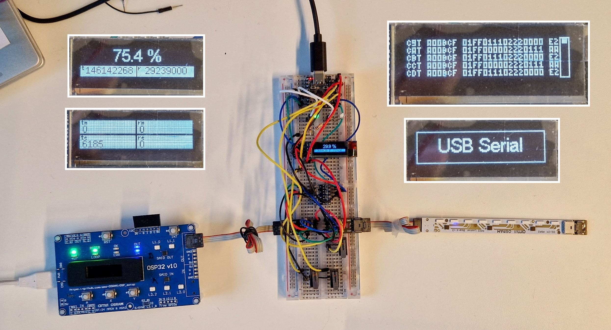

The breadboard has these schematics.

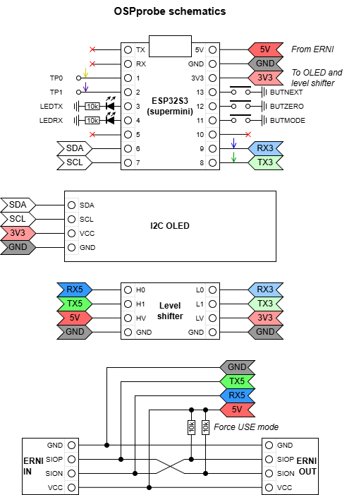

A component layout sketch is as follows.

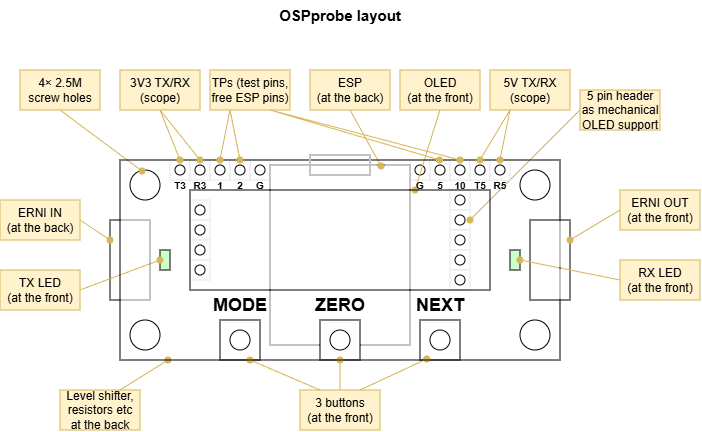


### PCB 

Real schematics and layout are published in [aotop](extras/schematics/readme.md).

(end)