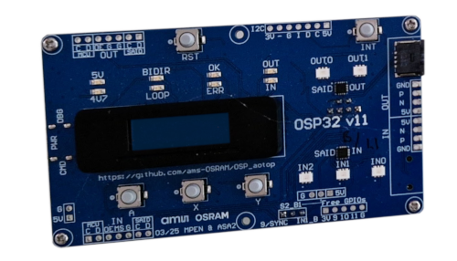
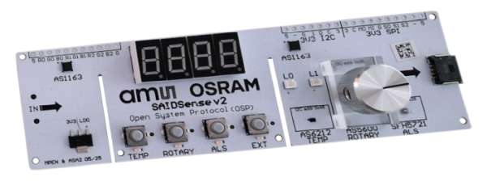
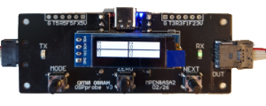

# Schematics

Schematics of multiple versions of the various boards related to the 
Arduino OSP evaluation kit are available here.

## Eval kit boards

- **OSP32**
  [v11](OSP32_complete_v11.pdf), [v10](OSP32_complete_v10.pdf)
  
  

- **SAIDbasic**
  [v8](SAIDbasic_complete_v8.pdf), [v7.1](SAIDbasic_complete_v7.1.pdf)
  
  

- **RGBIstrip**
  [V2.3](OSIRE_E3731i_V2.3.pdf) ⚠️**WARNING**⚠️ New RGBI strips have integrated terminator, see details in schematics.
  
  

- **SAIDlooker**
  [v4](SAIDLooker_complete_v4.pdf), [v3.1](SAIDLooker_complete_v3.1.pdf)
  
  

- **Terminator**
  [v3](Terminator_complete_v3.pdf), [v1.2](Terminator_complete_v1.2.pdf)
  
  

- **I2CEEPROMstick**
  [v2](I2CEEPROMstick-schematics_v2.pdf), [v1](I2CEEPROMstick-schematics_v1.0.pdf)
  
  

- **CANadapter**
  [v3.2](CANadapter_complete_v3.2.pdf)
  
  

## Also available

- **SAIDsense**
  [v6](SAIDsense_v6.pdf) [v5](SAIDsense_v5.pdf) [v2](SAIDsense_v2.pdf) 
  
  

- **OSPprobe**
  [v3](OSPprobe_v3.pdf) (needs patch)
  
  

(end)
