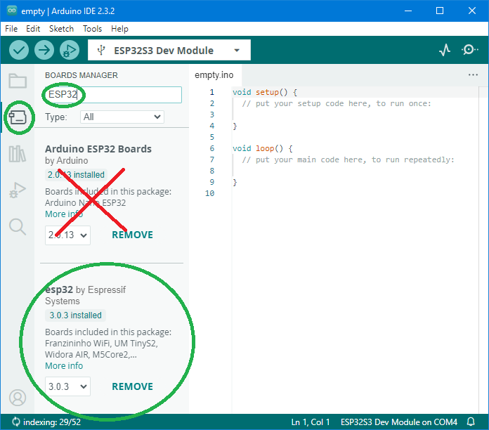
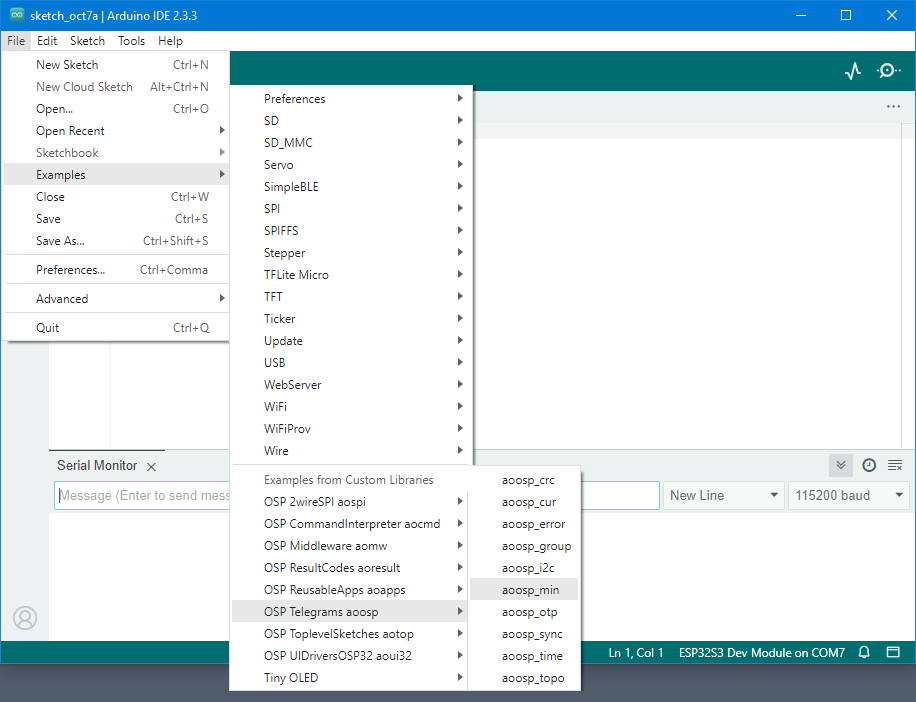

# Getting started with aolibs

This document gives instructions to get started with the **aolibs**;
short for Arduino OSP libraries from ams-OSRAM. 
This suite implements support for chips that use the
[Open System Protocol](https://ams-osram.com/technology/open-system-protocol), 
like the AS1163 ("SAID") or the OSIRE E3731i ("RGBi").

With these libraries comes an evaluation kit.
This kit consists of the **OSP32** board with some OSP demo boards.
The OSP32 board is a _Root MCU_ board, a board at the root 
of an OSP chain that contains an MCU that controls the OSP chain.
The _OSP demo_ boards are typically strips with some RGBi's, some SAIDs,
and/or some I2C devices. One example is the SAIDbasic board. 
OSP demo boards are connected to a Root MCU board, and controlled 
by the firmware running on the Root MCU.

The OSP32 board contains an _ESP32S3_. The _aolibs_ is a set of libraries 
to create an OSP control firmware for the ESP32. The libraries are intended 
to be used with the [_Arduino_](https://www.arduino.cc/) IDE.


## Prerequisites

The following items are needed to get started with software development
on the OSP32 board with the _aolibs_.

- Desktop/laptop - the developers of the _aolibs_ use Windows, but Linux or Mac should also work.
- Internet connection and install rights.
- OSP32 board (but some simple examples also work with just an ESP32).
- One ERNI Minibridge cable and/or a terminator.
- Optional some OSP demo boards (e.g. SAIDbasic, SAIDlooker).
- The latter three come in the SAID evaluation kit [link](todo:add).


## Installation

- [Download](https://www.arduino.cc/en/software) and install Arduino IDE.

- Use the BOARDS MANAGER to install the board "esp32 by **Espressif Systems**".
  Do not confuse the Espressif board packages with the one from Arduino 
  ("Arduino ESP32 Boards by **Arduino**").
  
  If the board is not listed, add `https://raw.githubusercontent.com/espressif/arduino-esp32/gh-pages/package_esp32_index.json`
  to "File > Preferences > Additional boards manager URLs"

  

- Probably the board install also installs the driver for the USB-to-UART bridge (CP2102N).
  If not download and install it from [Silabs](https://www.silabs.com/interface/usb-bridges/usbxpress/device.cp2102n-gqfn28).

- The _aolibs_ libraries need to be installed in the Arduino IDE.
  (at the moment of writing this note the _aolibs_ are formed by
  `aoresult`, `aospi`, `aoosp`, `aocmd`, `aomw`, `aoui32`, `aoapps`, and `aotop`)
  
  A typical Arduino setup has the libraries in `%USERPROFILE%\Documents\Arduino\libraries`,
  for example `C:\Users\John\Documents\Arduino\libraries`. There are two ways 
  to get the libraries there:
  
  - Search for the libraries in the Arduino Library Manager 
    (use "ams OSRAM OSP") in the Arduino IDE and install them from there.
    
    Easiest way is to install the _aotop_ library, since it depends on all
    others. Search for "OSP ToplevelSketches aotop" and it, and
    all others, will be installed by the Arduino IDE.
    
    (todo: add screenshot)

  - Get all the _aolibs_  eg download from [GitHub](https://github.com/ams-OSRAM-Group/OSP_aotop),
    and copy them into the Arduino `libraries` directory.
    
- Start Arduino IDE, connect the OSP32 board to the PC (plug the USB cable
  to the USB plug labeled "uart" on the ESP32 PCB).
  
  Select an example sketch, eg try `aoosp-min.ino`. It is a minimalist example
  sketch that blinks LEDs connected to the SAID on the OSP32 board.
  
  You can find the examples in the Arduino IDE via "File > Examples > ams-OSRAM OSP xxx > ..."
  Compile using "ESP32S3 Dev Module" and Upload, then check the Serial Monitor at 115200.
  
  

  As a full fledged demo use `aotop\examples\saidbasic` on OSP32 with SAIDbasic connected.


### Versions

In general, take the latest greatest of all components. If there are 
problems, these are the versions the _aolib_ developers used and tested.

- Arduino IDE 2.3.2.
- Board manager "esp32 by Espressif Systems" 3.0.2.
- No external libraries are used
- As PCB the OSP32 v9 and SAIDbasic v7.

In Arduino, we have File > Preferences > Compiler warnings > All to have the
highest checking level during development. At the moment of writing this
statement, a compile results in no errors or warnings.


## Documentation

Every _aolib_ comes with documentation in the form of a `readme.md` 
in its root directory, e.g. `arduinoosp\aolibs\aospi\readme.md`.

The `readme.md` of _aospi_ deserves reading, especially the section 
["System overview"](https://github.com/ams-OSRAM-Group/OSP_aospi/tree/main?tab=readme-ov-file#System-overview).

Every _aolib_ comes with examples, find them via 
"File > Examples > ams-OSRAM OSP xxx > ...".

Finally, in every cpp file (not in the header file), the public functions 
have a doc section, e.g. 

```cpp
/*!
    @brief  Sends RESET and INIT telegrams, auto detecting BiDir or Loop.
    @param  last
            Output parameter returning the address of 
            the last node - that is the chain length.
    @param  loop
            Output parameter returning the communication direction:
            1 iff Loop, 0 iff BiDir, -1 iff auto detect failed.
    @return aoresult_ok if all ok, otherwise an error code.
    #note   Controls the BiDir/Loop mux via aospi_set_dir_loop.
*/
aoresult_t aoosp_exec_resetinit(uint16_t *last, int *loop) {
 ...
}
```


## Which libraries to use

The _aolibs_ support software ranges from basic to complete demos.
Depending on your needs pick a subset from the following set.

- `aoresult`  
  This library is "empty"; it only contains the global list (enum) of error 
  codes used by the other libraries; it also implements a simple `assert`.
  
- `aospi`  
  This library implements the 2-wire SPI communication needed to send 
  telegrams to an OSP chain and receive responses from it. Sending and 
  receiving is on the level of byte arrays.
  
  The application is responsible to ensure the buffer contains the OSP 
  preamble, the destination address, the payload size, the telegram ID, and 
  its parameters and finally a matching CRC. All bits packed according to 
  the OSP standard.
  
  The OSP32 board has a mux to chose between two OSP configurations 
  ("loop" and "bidir"). This library also has function to control that mux.
  
  If you use a different protocol (e.g. 1-wire SPI), a different MCU 
  (e.g. NXP S32K144 instead of ESP32S3) or less flexibility (e.g. no 
  BiDir/Loop with auto select), this library would be replaced.

- `aoosp`  
  This library implements OSP communication at telegram level 
  (on top of `aospi`). The API has a function per telegram, with as 
  argument the address and the telegram parameters. The library does the 
  packing of byte buffers (and unpacking from byte buffers for responses).
  
  Any application for OSP is expected to use the libraries `aoosp` 
  on top of `aospi` on top of `aoresult`.

- `aocmd`  
  Implements a command interpreter and several commands (on top of `aoosp`).
  This is a bridge from serial-over-USB to `aoosp` (and `aospi`).
  It allows connecting a PC to the OSP32 board, and passing commands from 
  the PC to the ESP32, typically resulting in OSP telegrams being send and 
  received.
  
  This library is useful in the evaluation kit because it offers human
  interaction either direct typing in a terminal, or via a PC app that
  gives commands via serial-over-USB. Production firmware images are 
  not expected to use `aocmd`.

- `aomw`  
  This library contains an assortment of software features. The most 
  prominent one is the topology builder. It builds a map of the OSP chain, 
  making an abstraction of (an array of) RGB triplets irrespective if 
  they are an RGBI, or on a channel of a SAID.
  
  The library also contains a driver for an I2C EEPROM and an I2C IO 
  expander; both these devices are used as example I2C devices connected 
  to a SAID with I2C gateway enabled.
  
  The library also has a module to paint flags on an OSP chain, a driver for
  an I/O expander (connected to a SAID I2C bridge), and an interpreter for
  scripted animation instructions.
  
  All these help making flexible demos, but are not expected in production
  firmware.

- `aoui32` 
  This library contains drivers for the UI elements on the OSP32 board: 
  the A, X and Y button, the red and green signaling LEDs and the OLED screen. 
  It does not depend on any other of the other libraries.

- `aoapps`  
  This library contains various apps. A top-level Arduino sketch can 
  include a subset of these apps by registering them with the application 
  manager. That is also in module in the library.

  This library thus contains demo apps, but those are not expected in 
  production firmware.
  
- `aotop`  
  This is not a library, rather it contains sketches for advanced top
  level applications. It also contains generic documentation (spanning
  all _aolibs_).


## Library naming 

Every public symbol in any of the libraries is prefixed with a library
specific "prefix", see table below.

 | Arduino library name         | Prefix       |  Repository
 |:-----------------------------|:------------:|:---------------------------------------------------------------:|
 | OSP ToplevelSketches aotop   | aotop        | [OSP_aotop](https://github.com/ams-OSRAM-Group/OSP_aotop)       |
 | OSP ReusableApps aoapps      | aoapps       | [OSP_aoapps](https://github.com/ams-OSRAM-Group/OSP_aoapps)     |
 | OSP UIDriversOSP32 aoui32    | aoui32       | [OSP_aoui32](https://github.com/ams-OSRAM-Group/OSP_aoui32)     |
 | OSP Middleware aomw          | aomw         | [OSP_aomw](https://github.com/ams-OSRAM-Group/OSP_aomw)         |
 | OSP CommandInterpreter aocmd | aocmd        | [OSP_aocmd](https://github.com/ams-OSRAM-Group/OSP_aocmd)       |
 | OSP Telegrams aoosp          | aoosp        | [OSP_aoosp](https://github.com/ams-OSRAM-Group/OSP_aoosp)       |
 | OSP 2wireSPI aospi           | aospi        | [OSP_aospi](https://github.com/ams-OSRAM-Group/OSP_aospi)       |
 | OSP ResultCodes aoresult     | aoresult     | [OSP_aoresult](https://github.com/ams-OSRAM-Group/OSP_aoresult) |

The prefix is also used as an (informal) short name.


(end)
